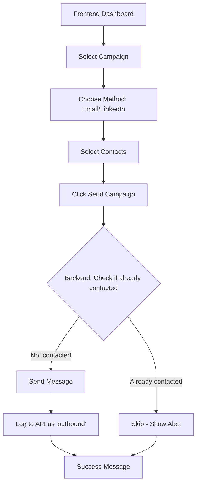

# Outreach Automation Dashboard

A full-stack automation tool for managing and executing email and LinkedIn outreach campaigns. The system fetches campaigns and contacts from a DigitalOcean API, allows users to select sending methods (Email via Gmail API or LinkedIn via Playwright), and automatically logs all outreach activities.

## 🎯 What This Project Does

- **Campaign Management**: View all available outreach campaigns from your CRM
- **Multi-Channel Outreach**: Send messages via:
  - 📧 **Email** using Gmail API (automated, no browser needed)
  - 💼 **LinkedIn** using Playwright (browser automation)
- **Contact Selection**: Choose specific contacts or send to all contacts in a campaign
- **Outreach Tracking**: Automatically logs all sent messages to prevent duplicate outreach
- **Smart Filtering**: Checks if contacts have already been contacted before sending

## 📊 Project Structure

```
OUTREACH-AUTOMATION/
├── outreach-backend/              # Python FastAPI backend
│   ├── .storage/                  # Auth credentials (git-ignored)
│   │   ├── credentials.json       # Gmail OAuth credentials (you create this)
│   │   ├── token.json            # Gmail OAuth token (auto-generated)
│   │   └── linkedin_state.json   # LinkedIn session (auto-generated)
│   ├── venv/                     # Python virtual environment
│   ├── api_client.py             # DigitalOcean API client
│   ├── config.py                 # Configuration loader
│   ├── email_sender.py           # Gmail API email sender
│   ├── linkedIn_sender.py        # Playwright LinkedIn automation
│   ├── main.py                   # FastAPI server
│   ├── setup_gmail_oauth.py      # Gmail OAuth setup script
│   ├── requirements.txt          # Python dependencies
│   └── .env                      # Environment variables (you create this)
│
├── outreach-frontend/            # React + Vite frontend
│   ├── src/
│   │   ├── App.jsx              # Main dashboard component
│   │   ├── App.css              # Styles
│   │   └── main.jsx             # React entry point
│   ├── package.json             # Node dependencies
│   └── vite.config.js           # Vite configuration
│
├── .gitignore                   # Prevents committing sensitive files
└── README.md                    # This file
```
---

## 🚀 Setup Instructions

### Prerequisites

- **Python 3.8+** (Python 3.12 recommended)
- **Node.js 18+** and npm
- **Git**
- **Google Cloud Account** (for Gmail API)
- **DigitalOcean API** access

---

## 📦 Step 1: Clone and Install Dependencies

### For All Operating Systems:

```bash
# Clone the repository
git clone <your-repo-url>
cd outreach-automation
```

### Backend Setup (Python)

#### **macOS/Linux:**
```bash
cd outreach-backend

# Create virtual environment
python3 -m venv venv

# Activate virtual environment
source venv/bin/activate

# Install dependencies
pip install -r requirements.txt

# Install Playwright browsers
playwright install chromium
```

#### **Windows:**
```powershell
cd outreach-backend

# Create virtual environment
python -m venv venv

# Activate virtual environment
venv\Scripts\activate

# Install dependencies
pip install -r requirements.txt

# Install Playwright browsers
playwright install chromium
```

#### **Playwright Troubleshooting:**

If `playwright install` fails:

**macOS/Linux:**
```bash
# Install system dependencies
python -m playwright install-deps
playwright install chromium
```

**Windows:**
- Make sure you have **Visual C++ Redistributables** installed
- Run PowerShell **as Administrator** and retry:
  ```powershell
  playwright install chromium
  ```

**All Platforms:**
```bash
# If still failing, try:
pip uninstall playwright
pip install playwright==1.40.0
playwright install chromium
```

### Frontend Setup (Node.js)

```bash
cd ../outreach-frontend

# Install dependencies
npm install
```

---

## ⚙️ Step 2: Configuration Files

### 1. Create `.storage/credentials.json` (Gmail OAuth)

Create the directory and file:

```bash
# From outreach-backend directory
mkdir -p .storage
```

Create `.storage/credentials.json` with this content:

```json
{
  "installed": {
    "client_id": "1052426663720-2i31cdaf0cov6ojjfjhfa4irucst7ch5.apps.googleusercontent.com",
    "project_id": "carbonsustaindev",
    "auth_uri": "https://accounts.google.com/o/oauth2/auth",
    "token_uri": "https://oauth2.googleapis.com/token",
    "auth_provider_x509_cert_url": "https://www.googleapis.com/oauth2/v1/certs",
    "client_secret": "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",
    "redirect_uris": ["http://localhost"]
  }
}
```

### 2. Create `.env` File

Create `outreach-backend/.env` with this content:

```properties
# API Configuration
BASE_URL=https://sustainb3tr-zx59d.ondigitalocean.app
API_TOKEN=

# Gmail API Configuration
GMAIL_CREDENTIALS_PATH=.storage/credentials.json
GMAIL_TOKEN_PATH=.storage/token.json
SENDER_EMAIL=your-email@gmail.com

# Test Configuration  
TEST_EMAIL=pbryzek@berkeley.edu
TEST_CAMPAIGN_ID=3

# Timing (milliseconds between emails)
SEND_MIN_DELAY_MS=1500
SEND_MAX_DELAY_MS=3500
```

**Important:** Replace `your-email@gmail.com` with your actual Gmail address!

---

## 🔐 Step 3: Gmail OAuth Setup

Before running the backend, you need to authenticate with Gmail:

```bash
cd outreach-backend

# Make sure virtual environment is activated
# macOS/Linux: source venv/bin/activate
# Windows: venv\Scripts\activate

# Run OAuth setup
python setup_gmail_oauth.py
```

**What happens:**
1. A browser window will open
2. Sign in to your Gmail account
3. Grant permissions to send emails
4. `token.json` will be created automatically
5. You only need to do this once!

---

## 🏃 Step 4: Run the Application

### Terminal 1: Start Backend

```bash
cd outreach-backend

# Activate virtual environment
# macOS/Linux: source venv/bin/activate
# Windows: venv\Scripts\activate

# Run FastAPI server
python main.py
```

You should see:
```
INFO:     Uvicorn running on http://127.0.0.1:8000
```

### Terminal 2: Start Frontend

**Open a NEW terminal window:**

```bash
cd outreach-frontend

# Start Vite dev server
npm run dev
```

You should see:
```
VITE v5.0.0  ready in 500 ms
➜  Local:   http://localhost:5173/
```

### 🎉 Access the Dashboard

Open your browser and go to: **http://localhost:5173**

---

## 🔧 How to Use

### 1. Select a Campaign
- View all campaigns loaded from your CRM
- Each card shows campaign name and ID

### 2. Choose Sending Method
- **📧 Email**: Uses Gmail API (fast, automated)
- **💼 LinkedIn**: Opens browser with Playwright (semi-automated)

### 3. Select Contacts
- **All Contacts**: Send to everyone in the campaign
- **Specific Contact**: Choose one person from the dropdown

### 4. Send Campaign
- Click "🚀 Send Campaign"
- System checks if contact was already contacted
- If not contacted: Sends message and logs to API
- If already contacted: Skips to avoid duplicates

---

## 🔒 Security & .gitignore

The `.gitignore` file prevents sensitive files from being committed:

```gitignore
# Sensitive authentication files
.storage/
credentials.json
token.json
*.json

# Environment variables
.env

# Python cache
__pycache__/
*.pyc
venv/

# Node modules
node_modules/
```

**Never commit:**
- `.env` files
- `credentials.json`
- `token.json`
- `.storage/` folder contents

---

## 📝 API Endpoints

### Backend (http://127.0.0.1:8000)

| Endpoint | Method | Description |
|----------|--------|-------------|
| `/campaigns` | GET | List all campaigns |
| `/campaigns/{id}/contacts?contact_method={method}` | GET | Get contacts for campaign |
| `/run_campaign` | POST | Execute campaign send |

### Request Body for `/run_campaign`:
```json
{
  "campaign_id": 3,
  "contact_method": "email",  // or "linkedin"
  "contact_ids": [32]  // or [] for all contacts
}
```

---

## 🐛 Troubleshooting

### Backend won't start:
```bash
# Check if port 8000 is in use
# macOS/Linux:
lsof -i :8000
kill -9 <PID>

# Windows:
netstat -ano | findstr :8000
taskkill /PID <PID> /F
```

### Gmail OAuth fails:
1. Delete `token.json`
2. Run `python setup_gmail_oauth.py` again
3. Make sure you're using the correct Gmail account

### Playwright browser won't open:
```bash
# Reinstall Playwright browsers
playwright install --force chromium
```

### LinkedIn automation fails:
1. First run: You'll need to manually log into LinkedIn
2. Session is saved to `.storage/linkedin_state.json`
3. Future runs will reuse this session

### "Failed to fetch contacts":
- Check that `BASE_URL` in `.env` is correct
- Verify you have network access to the DigitalOcean API
- Check backend terminal for detailed error messages

---

## 🔄 Workflow Overview



---

## 📚 Tech Stack

**Backend:**
- Python 3.12
- FastAPI (web framework)
- Google Gmail API (email sending)
- Playwright (LinkedIn automation)
- Requests (API client)

**Frontend:**
- React 19
- Vite (build tool)
- Tailwind CSS (styling)
- Native Fetch API

**External APIs:**
- DigitalOcean App Platform (CRM/contact management)
- Google Gmail API (email delivery)
- LinkedIn (via browser automation)

---

## 🤝 Contributing

1. Create a feature branch
2. Make your changes
3. Test thoroughly
4. Submit a pull request

---

## 📄 License

[Your License Here]

---

## 👥 Team

Built by **CarbonSustain** team for automated outreach campaigns.

---

## 📞 Support

For issues or questions:
1. Check the troubleshooting section above
2. Review backend terminal output for error messages
3. Check browser console (F12) for frontend errors
4. Contact the development team

---

**Happy Outreach! 🚀**